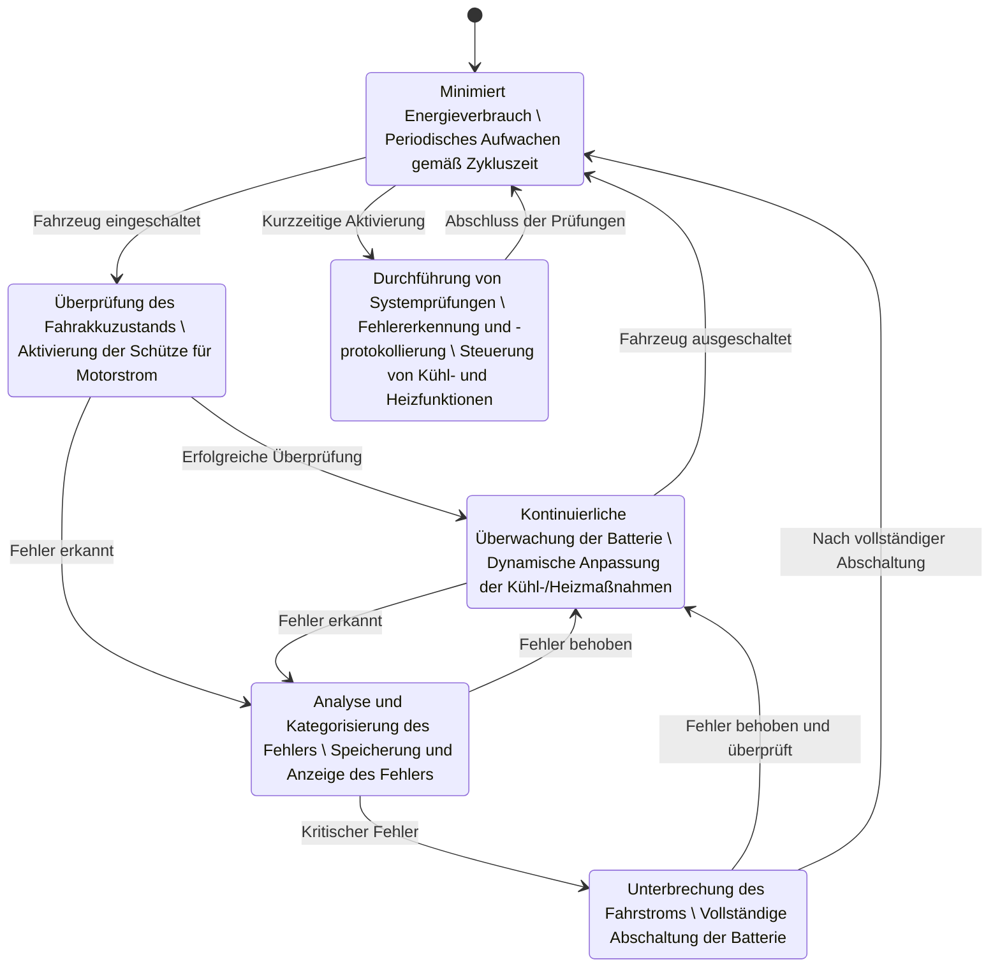
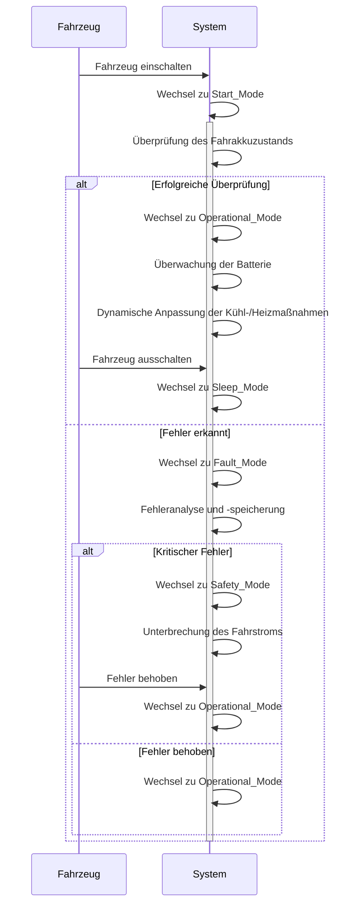

# BMS State Machine

Dieses Zustandsdiagramm beschreibt die verschiedenen Betriebszustände des BMS und die Übergänge zwischen diesen Zuständen basierend auf bestimmten Ereignissen und Bedingungen.

## **Übersicht des Zustandsdiagramms**

Das Zustandsdiagramm besteht aus sechs Hauptzuständen:

1. **Sleep_Mode**
2. **Active_Mode**
3. **Start_Mode**
4. **Operational_Mode**
5. **Fault_Mode**
6. **Safety_Mode**

Die Zustandsmaschine beginnt im **Sleep_Mode** und wechselt je nach Ereignissen und Bedingungen zwischen den verschiedenen Zuständen.

Das Sequenzdiagramm beginnt im **Sleep_Mode** und wechselt je nach Ereignissen und Bedingungen zwischen den verschiedenen Zuständen.

## **Detaillierte Beschreibung der Zustände und Übergänge**

### 1. **Sleep_Mode (Schlafmodus)**
**Beschreibung:**
- **Minimiert Energieverbrauch:** Im Schlafmodus verbraucht das BMS so wenig Energie wie möglich, um die Batterielebensdauer zu verlängern.
- **Periodisches Aufwachen gemäß Zykluszeit:** Das System weckt sich regelmäßig auf, um bestimmte Aufgaben zu erledigen oder den Systemstatus zu überprüfen.

**Übergänge:**
- **Sleep_Mode → Start_Mode:** **Ereignis:** Fahrzeug eingeschaltet.  
  Wenn das Fahrzeug eingeschaltet wird, wechselt das BMS vom Schlafmodus in den Startmodus, um sich auf den Betrieb vorzubereiten.
  
- **Sleep_Mode → Active_Mode:** **Ereignis:** Kurzzeitige Aktivierung.  
  Ein kurzfristiges Ereignis oder eine Anforderung kann das BMS aus dem Schlafmodus in den Aktivmodus versetzen, um bestimmte Prüfungen oder Steuerungen durchzuführen.

### 2. **Active_Mode (Aktivmodus)**
**Beschreibung:**
- **Durchführung von Systemprüfungen:** Das BMS führt umfassende Prüfungen des Systems durch, um sicherzustellen, dass alle Komponenten ordnungsgemäß funktionieren.
- **Fehlererkennung und -protokollierung:** Fehler werden erkannt, analysiert und protokolliert, um zukünftige Analysen und Wartungen zu erleichtern.
- **Steuerung von Kühl- und Heizfunktionen:** Das BMS steuert aktiv die Kühl- und Heizsysteme, um die optimale Temperatur der Batterie zu gewährleisten.

**Übergänge:**
- **Active_Mode → Sleep_Mode:** **Ereignis:** Abschluss der Prüfungen.  
  Nach Abschluss der notwendigen Prüfungen und Steuerungsaufgaben wechselt das BMS zurück in den Schlafmodus, um Energie zu sparen.

### 3. **Start_Mode (Startmodus)**
**Beschreibung:**
- **Überprüfung des Fahrakkuzustands:** Das BMS überprüft den Zustand des Fahraktsystems, um sicherzustellen, dass alles bereit für den Betrieb ist.
- **Aktivierung der Schütze für Motorstrom:** Die Schütze (Schaltvorrichtungen) werden aktiviert, um den Motorstrom bereitzustellen.

**Übergänge:**
- **Start_Mode → Operational_Mode:** **Ereignis:** Erfolgreiche Überprüfung.  
  Wenn alle Überprüfungen erfolgreich abgeschlossen wurden, wechselt das BMS in den Betriebsmodus, um die kontinuierliche Überwachung und Steuerung zu übernehmen.
  
- **Start_Mode → Fault_Mode:** **Ereignis:** Fehler erkannt.  
  Wird ein Fehler während der Überprüfungen festgestellt, wechselt das BMS in den Fehlerzustand zur weiteren Analyse und Handhabung.

### 4. **Operational_Mode (Betriebsmodus)**
**Beschreibung:**
- **Kontinuierliche Überwachung der Batterie:** Das BMS überwacht ständig den Zustand der Batterie, einschließlich Ladestand, Temperatur und anderen wichtigen Parametern.
- **Dynamische Anpassung der Kühl-/Heizmaßnahmen:** Basierend auf den Überwachungsdaten passt das BMS die Kühl- und Heizsysteme dynamisch an, um die Batterie im optimalen Temperaturbereich zu halten.

**Übergänge:**
- **Operational_Mode → Sleep_Mode:** **Ereignis:** Fahrzeug ausgeschaltet.  
  Wenn das Fahrzeug ausgeschaltet wird, wechselt das BMS in den Schlafmodus, um den Energieverbrauch zu minimieren.
  
- **Operational_Mode → Fault_Mode:** **Ereignis:** Fehler erkannt.  
  Bei der kontinuierlichen Überwachung können Fehler erkannt werden, die einen Wechsel in den Fehlerzustand erfordern.

### 5. **Fault_Mode (Fehlerzustand)**
**Beschreibung:**
- **Analyse und Kategorisierung des Fehlers:** Das BMS analysiert den aufgetretenen Fehler und kategorisiert ihn nach seiner Schwere und Art.
- **Speicherung und Anzeige des Fehlers:** Der Fehler wird gespeichert und kann über ein Display oder ein Diagnosewerkzeug angezeigt werden.

**Übergänge:**
- **Fault_Mode → Safety_Mode:** **Ereignis:** Kritischer Fehler.  
  Bei einem kritischen Fehler, der das sichere Funktionieren des Fahrzeugs beeinträchtigt, wechselt das BMS in den Sicherheitszustand.
  
- **Fault_Mode → Operational_Mode:** **Ereignis:** Fehler behoben.  
  Wenn der Fehler behoben wurde, kehrt das BMS in den Betriebsmodus zurück, um die normale Überwachung fortzusetzen.

### 6. **Safety_Mode (Sicherheitszustand)**
**Beschreibung:**
- **Unterbrechung des Fahrstroms:** Das BMS unterbricht den Fahrstrom, um die Sicherheit zu gewährleisten und weitere Schäden zu verhindern.
- **Vollständige Abschaltung der Batterie:** Die Batterie wird vollständig abgeschaltet, um ein sicheres Verhalten des Fahrzeugs zu gewährleisten.

**Übergänge:**
- **Safety_Mode → Operational_Mode:** **Ereignis:** Fehler behoben und überprüft.  
  Nachdem der kritische Fehler behoben und überprüft wurde, wechselt das BMS zurück in den Betriebsmodus.
  
- **Safety_Mode → Sleep_Mode:** **Ereignis:** Nach vollständiger Abschaltung.  
  Nach der vollständigen Abschaltung der Batterie kann das BMS in den Schlafmodus zurückkehren, wenn keine weiteren Aktionen erforderlich sind.

## **Gesamtverhalten des Systems**

Das Zustandsdiagramm beschreibt ein robustes und flexibles Batteriemanagementsystem, das in der Lage ist, effizient zwischen verschiedenen Betriebszuständen zu wechseln, um den Energieverbrauch zu minimieren und gleichzeitig die Sicherheit und Zuverlässigkeit des Fahrzeugs zu gewährleisten.

### **Normale Betriebsabläufe:**

1. **Start des Fahrzeugs:**
   - Das Fahrzeug wird eingeschaltet, wodurch das BMS vom **Sleep_Mode** in den **Start_Mode** wechselt.
   - Im **Start_Mode** überprüft das BMS den Fahrakkuzustand und aktiviert die Schütze für den Motorstrom.
   - Bei erfolgreicher Überprüfung wechselt das BMS in den **Operational_Mode**.

2. **Kontinuierliche Überwachung:**
   - Im **Operational_Mode** überwacht das BMS ständig die Batterie und passt die Kühl- und Heizmaßnahmen dynamisch an.
   - Bei Bedarf kann das BMS in den **Active_Mode** wechseln, um zusätzliche Prüfungen durchzuführen oder spezifische Steuerungen vorzunehmen.

3. **Beendigung des Fahrzeugs:**
   - Wenn das Fahrzeug ausgeschaltet wird, wechselt das BMS vom **Operational_Mode** zurück in den **Sleep_Mode**, um Energie zu sparen.

### **Fehlerbehandlung:**

1. **Fehlererkennung:**
   - Während des Betriebs können Fehler erkannt werden, die das BMS in den **Fault_Mode** versetzen.

2. **Fehleranalyse:**
   - Im **Fault_Mode** analysiert und kategorisiert das BMS den Fehler.
   - Wenn es sich um einen kritischen Fehler handelt, wechselt das System in den **Safety_Mode**, um den Fahrstrom zu unterbrechen und die Batterie vollständig abzuschalten.

3. **Fehlerbehebung:**
   - Nach der Behebung des Fehlers wechselt das BMS zurück in den **Operational_Mode**, um die normale Überwachung fortzusetzen.
   - Falls keine weiteren Maßnahmen erforderlich sind, kann das System auch in den **Sleep_Mode** wechseln.

### **Sicherheitsmechanismen:**

Der Übergang in den **Safety_Mode** bei kritischen Fehlern stellt sicher, dass das Fahrzeug in einem sicheren Zustand bleibt, indem der Fahrstrom unterbrochen und die Batterie abgeschaltet wird. Dies verhindert mögliche Schäden oder gefährliche Situationen, die durch fehlerhafte Batteriebetriebe entstehen könnten.

## **Zusammenfassung**

Die Zustandsmaschine für das Batteriemanagementsystem (BMS) ist so konzipiert, dass sie effizient zwischen verschiedenen Betriebszuständen wechselt, um den Energieverbrauch zu minimieren, die Batterielebensdauer zu verlängern und die Sicherheit des Fahrzeugs zu gewährleisten. Durch die klare Strukturierung der Zustände und Übergänge kann das BMS effektiv auf normale Betriebsbedingungen sowie auf Fehler reagieren, wodurch ein zuverlässiger und sicherer Betrieb des Fahrzeugs unterstützt wird.
