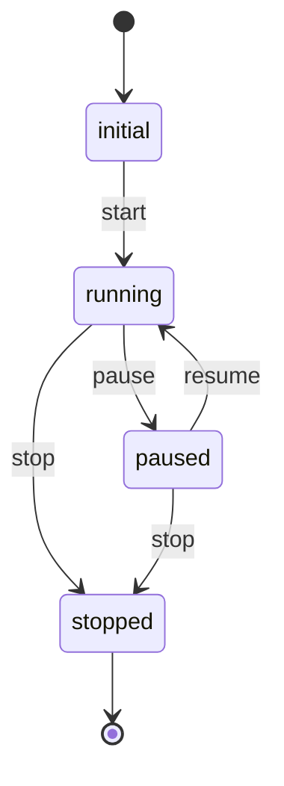

# State Machine Explanation

## **States**
The state machine consists of the following states:

1. **`initial`**: 
   - The starting state of the system.
2. **`running`**: 
   - Represents the system in an active or operational state.
3. **`paused`**: 
   - Indicates a paused state where the system can either resume or stop.
4. **`stopped`**: 
   - A terminal state from which no further transitions occur.

---

## **Transitions**
The transitions between states are as follows:

1. **`start`**: 
   - Transitions from `initial` to `running`.
2. **`pause`**: 
   - Transitions from `running` to `paused`.
3. **`resume`**: 
   - Transitions from `paused` to `running`.
4. **`stop`**: 
   - Can occur from `running` or `paused`, transitioning the system to `stopped`.

---

