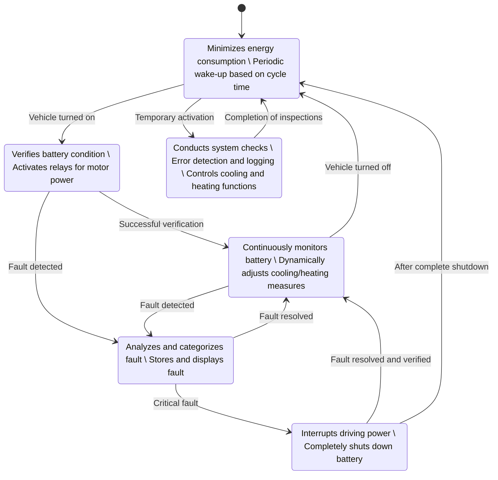
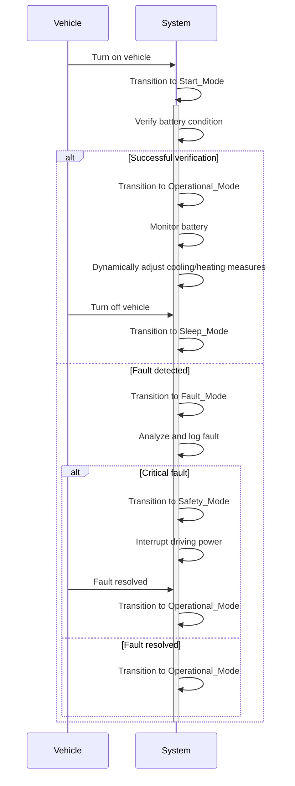

# BMS State Machine

This state diagram outlines the various operating states of the Battery Management System (BMS) and the transitions between these states based on specific events and conditions.

## Overview of the State Diagram

The state diagram comprises six primary states: Sleep Mode, Active Mode, Start Mode, Operational Mode, Fault Mode, and Safety Mode. The state machine initiates in Sleep Mode and transitions between the different states in response to various events and conditions.

The sequence diagram begins in Sleep Mode and transitions between various states based on events and conditions.

## Detailed Description of States and Transitions

### 1. Sleep Mode

Description:
In Sleep Mode, the BMS minimizes energy consumption to extend the battery's lifespan. The system periodically wakes up according to a programmed cycle time to perform specific tasks or check the system status.

Transitions:
- Sleep Mode to Start Mode: Triggered when the vehicle is turned on. This transition prepares the BMS for operation.
- Sleep Mode to Active Mode: Occurs during temporary activations, such as when immediate inspections or controls are required.

### 2. Active Mode

Description:
Active Mode is a transient state where the BMS conducts comprehensive system checks to ensure all components are functioning correctly. During this state, the BMS detects and logs any errors and actively controls the cooling and heating systems to regulate the battery's temperature.

Transitions:
- Active Mode to Sleep Mode: After completing the necessary inspections and control tasks, the BMS returns to Sleep Mode to conserve energy.

### 3. Start Mode

Description:
Start Mode is initiated when the vehicle begins to start. In this state, the BMS verifies the condition of the vehicle's battery and activates the necessary relays to supply power to the motor.

Transitions:
- Start Mode to Operational Mode: Occurs upon successful verification of the battery condition, allowing the BMS to take over continuous monitoring and control.
- Start Mode to Fault Mode: If a fault is detected during verification, the BMS transitions to Fault Mode for further analysis and handling.

### 4. Operational Mode

Description:
Operational Mode represents the primary operating state during vehicle use. The BMS continuously monitors battery parameters and dynamically adjusts cooling and heating measures to optimize battery performance and longevity.

Transitions:
- Operational Mode to Sleep Mode: Triggered when the vehicle is turned off, prompting the BMS to minimize energy consumption.
- Operational Mode to Fault Mode: Activated upon detection of a fault during continuous monitoring, necessitating a transition to Fault Mode.

### 5. Fault Mode

Description:
Fault Mode is activated when the BMS detects an error within the battery system. In this state, the BMS analyzes and categorizes the fault, stores the information for future maintenance, and displays an error indicator to the driver.

Transitions:
- Fault Mode to Safety Mode: Initiated when a critical fault is identified that compromises the vehicle's safe operation.
- Fault Mode to Operational Mode: Occurs when the detected fault is resolved, allowing the BMS to resume normal monitoring and control.

### 6. Safety Mode

Description:
Safety Mode is the ultimate protective state activated in response to critical faults. In this state, the BMS interrupts the driving power and completely shuts down the battery to ensure the safety of the vehicle and its occupants.

Transitions:
- Safety Mode to Operational Mode: After the critical fault is resolved and verified, the BMS transitions back to Operational Mode.
- Safety Mode to Sleep Mode: Occurs following the complete shutdown of the battery when no further actions are required.

## Overall System Behavior

The state diagram describes a robust and flexible Battery Management System capable of efficiently transitioning between various operating states to minimize energy consumption while ensuring the vehicle's safety and reliability.

### Normal Operational Flows:

1. Vehicle Start:
   Upon turning on the vehicle, the control unit initiates a transition from Sleep Mode to Start Mode. In Start Mode, the BMS verifies the battery condition and activates the necessary relays to supply power to the motor. If the verification is successful, the BMS transitions to Operational Mode.

2. Continuous Monitoring:
   In Operational Mode, the BMS continuously monitors battery parameters and dynamically adjusts cooling and heating measures to maintain optimal conditions. If necessary, the BMS can temporarily switch to Active Mode to perform additional inspections or specific controls.

3. Vehicle Shutdown:
   When the vehicle is turned off, the BMS transitions from Operational Mode back to Sleep Mode to conserve energy.

### Error Handling:

1. Error Detection:
   During operation, the BMS may detect errors that prompt a transition to Fault Mode.

2. Error Analysis:
   In Fault Mode, the BMS analyzes and categorizes the error. If the error is critical, the system transitions to Safety Mode to protect the battery and prevent potential hazards by interrupting the driving power and shutting down the battery.

3. Error Resolution:
   Once the error is resolved, the BMS can transition back to Operational Mode to resume normal monitoring and control. If no further actions are needed, the system may also revert to Sleep Mode.

### Safety Mechanisms:

Transitioning to Safety Mode in the event of critical faults ensures that the vehicle remains in a safe state by interrupting the driving power and completely shutting down the battery. This prevents potential damage or dangerous situations that could arise from malfunctioning battery operations.

## Summary

The state machine for the Battery Management System (BMS) is designed to efficiently transition between various operating states to minimize energy consumption, extend battery lifespan, and ensure vehicle safety. By clearly structuring the states and transitions, the BMS can effectively respond to both normal operational conditions and faults, thereby supporting the reliable and secure operation of the vehicle.