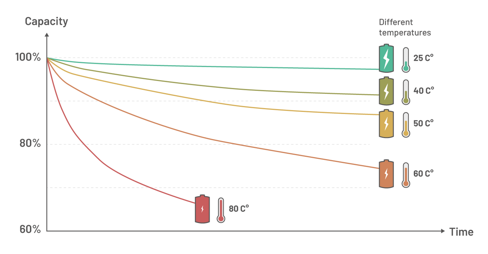
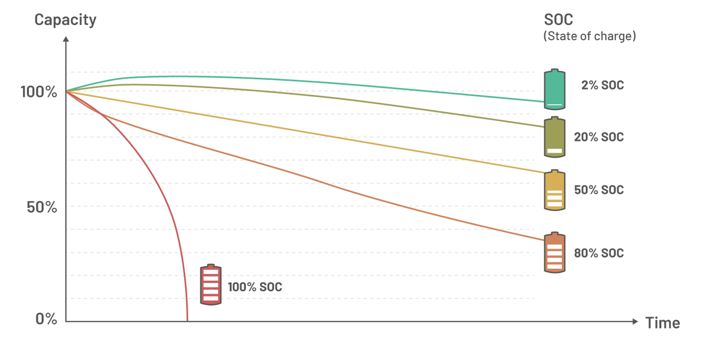

# Calendar Aging  

**Calendar aging** refers to the gradual decline in a battery’s capacity, efficiency, and overall performance over time, even when the battery is not actively in use. This phenomenon significantly affects lithium-ion batteries, which are prevalent in electric vehicles (EVs), consumer electronics, and energy storage systems. Understanding the mechanisms, influencing factors, and mitigation strategies for calendar aging is crucial for enhancing battery longevity and performance, making it a pivotal consideration in the design and management of Battery Management Systems (BMS).

---

## Understanding Calendar Aging

### Definition

Calendar aging encompasses the chemical and physical deterioration of a battery's components over time, independent of its operational cycles. This degradation is primarily driven by:

- **Electrolyte Decomposition:** Breakdown of the electrolyte can reduce ionic conductivity and overall battery performance.
- **Solid Electrolyte Interphase (SEI) Growth:** Expansion of the SEI layer on the anode consumes active lithium ions, increasing internal resistance.
- **Loss of Active Lithium Ions:** Diminished availability of lithium ions for charge storage reduces capacity.
- **Electrode Material Degradation:** Structural changes and material loss in cathodes and anodes impair battery functionality.

### Key Indicators

- **Capacity Loss:** Decline in the total charge a battery can store, often measured as a percentage of its initial capacity.
- **Increased Internal Resistance:** Hinders efficient current flow, reducing power delivery and charging efficiency.
- **Voltage Fluctuations:** Impacts the battery’s ability to maintain stable voltage levels during discharge and charge cycles.

---

## Mechanisms of Calendar Aging

### Solid Electrolyte Interphase (SEI) Growth

- **Formation and Expansion:** The SEI layer forms on the anode during initial battery cycles and continues to grow over time.
- **Impact:** Continuous SEI growth consumes active lithium ions and increases internal resistance, leading to capacity fade and reduced power efficiency.

### Electrolyte Decomposition

- **Chemical Breakdown:** Elevated temperatures accelerate the decomposition of the electrolyte, producing gases and harmful byproducts.
- **Consequences:** Depletion of active materials and the formation of resistive layers contribute to capacity loss and diminished battery performance.

### Cathode and Anode Degradation

- **Cathode Deterioration:** High temperatures can cause the dissolution of transition metals from the cathode, weakening its structural integrity.
- **Anode Issues:** Lithium plating on the anode, especially at high states of charge (SOC), can lead to short circuits and reduced battery life.

---

## Factors Influencing Calendar Aging

### Storage Temperature

Temperature is the most critical factor affecting calendar aging:

- **High Temperatures (Above 40°C):**
  - Accelerate chemical reactions.
  - Promote SEI layer growth and electrolyte decomposition.
  - Lead to rapid capacity loss and increased internal resistance.

- **Low Temperatures (Below 15°C):**
  - Slow down aging processes.
  - May cause lithium plating during reactivation, potentially damaging the anode.

| **Temperature (°C)** | **Effect on Calendar Aging**                     |
|----------------------|-------------------------------------------------|
| 0–15                 | Slows degradation, ideal for long-term storage. |
| 15–25                | Minimal degradation, optimal performance range.|
| 25–40                | Moderate degradation, manageable impact.        |
| >40                  | Rapid degradation, significant capacity loss.   |

### State of Charge (SOC)

The battery's SOC during storage significantly influences its degradation rate:

- **High SOC (>80%):**
  - Encourages electrolyte oxidation and accelerated SEI growth.
  - Stresses the cathode structure, leading to material degradation.

- **Low SOC ( < 20%):**
  - Risks copper dissolution from the anode, compromising electrical connectivity.

- **Optimal SOC (40-60%):**
  - Minimizes internal stress.
  - Reduces the rate of chemical reactions that contribute to aging.

| **SOC Range (%)** | **Impact on Calendar Aging**               |
|--------------------|-------------------------------------------|
| < 20                | Risk of anode copper dissolution.        |
| 20 – 40              | Low degradation, safe for storage.       |
| 40 – 60              | Optimal range, minimal calendar aging.   |
| > 80                | Accelerates SEI growth and aging.        |

### Storage Environment

Environmental factors also play a role in calendar aging:

- **Humidity:** Excess moisture can penetrate battery casings, leading to internal corrosion and accelerated degradation.
- **Ventilation:** Poor ventilation traps heat, exacerbating temperature-related aging and potentially leading to thermal runaway in extreme cases.

---

## Calendar Aging Effects on Battery Performance

### Capacity Fade

- **Description:** A measurable reduction in the battery's maximum charge storage capacity over time.
- **Impact:** Leads to shorter operational times between charges and reduced overall battery lifespan.

### Increased Internal Resistance

- **Description:** The growth of resistive layers within the battery impedes efficient current flow.
- **Impact:** Results in lower power output, slower charging rates, and increased heat generation during operation.

### Thermal Stability

- **Description:** Aging affects the battery’s ability to manage and dissipate heat effectively.
- **Impact:** Increases the risk of thermal runaway, especially under high load or rapid charging conditions.

| **Performance Metric** | **Impact of Calendar Aging** |
|------------------------|------------------------------|
| Capacity               | Declines progressively.     |
| Internal Resistance    | Increases over time.        |
| Energy Efficiency      | Decreases significantly.    |
| Thermal Stability      | Diminishes over prolonged use. |

---

## Experimental Insights into Calendar Aging

### Storage Temperature vs. Aging Rate

Experimental studies have demonstrated the profound impact of temperature on calendar aging:

- **15°C Storage:**
  - Exhibited minimal degradation over one year.
  - Maintained over 95% of initial capacity.

- **60°C Storage:**
  - Showed up to 20% capacity loss within the same period.
  - Accelerated SEI growth and electrolyte decomposition.

### Storage SOC vs. Capacity Fade

- **100% SOC Storage:**
  - Batteries degraded twice as fast compared to those stored at 50% SOC.
  - Increased SEI layer growth and structural stress on the cathode.

- **0% SOC Storage:**
  - Potential for anode damage due to copper dissolution.
  - Reduced ability to recover full capacity upon reactivation.

---

## Mitigating Calendar Aging

### Storage Best Practices

- **Temperature Control:**
  - Store batteries in cool, dry environments with temperatures between **15°C and 25°C**.
  - Avoid exposure to direct sunlight or heat sources to prevent rapid degradation.

- **Optimal SOC Maintenance:**
  - Maintain an SOC of **40-60%** for long-term storage.
  - Prevent both deep discharges and full charges to minimize stress on the battery.

- **Environmental Protection:**
  - Ensure battery casings are sealed to protect against humidity and contaminants.
  - Use climate-controlled storage facilities to maintain consistent environmental conditions.

### Thermal Management Systems

- **Temperature-Controlled Environments:**
  - Utilize storage facilities equipped with HVAC systems to regulate temperature.
  - Implement passive cooling solutions, such as insulation, to maintain stable temperatures.

- **Integrated Cooling Mechanisms:**
  - Incorporate active cooling systems in battery storage units to dissipate heat effectively.
  - Use phase-change materials or heat exchangers to manage thermal loads.

### Optimized Battery Management Systems (BMS)

- **Real-Time Monitoring:**
  - Continuously track SOC and temperature to ensure they remain within optimal ranges.
  - Detect early signs of degradation and adjust operational parameters accordingly.

- **Adaptive Charging and Discharging:**
  - Implement algorithms that adjust charging rates based on current battery conditions.
  - Prevent overcharging and excessive discharging to reduce stress and extend battery life.

- **Cell Balancing:**
  - Ensure uniform charge distribution across all cells to prevent imbalances that can accelerate aging.
  - Use active or passive balancing techniques to maintain cell health.
