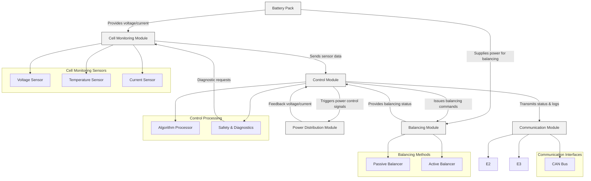

# BMS Architectural Design

A Battery Management System is an essential component for modern energy storage systems. Its role is to monitor and manage the battery pack’s state, ensuring safe, efficient, and prolonged operation. The BMS handles tasks such as cell monitoring, state-of-charge estimation, balancing, fault detection, and communication with higher-level systems.

The architectural design of a BMS generally follows a modular approach, separating the monitoring, control, communication, and power modules into distinct layers. This separation of concerns not only makes the system scalable but also simplifies both troubleshooting and upgrades.

---

## Architectural Components

The BMS architecture can be divided into the following primary modules:

1. **Cell Monitoring Module**  
   - **Purpose:** Continuously measures cell voltage, current, and temperature.  
   - **Components:** Voltage sensors, temperature sensors, current sensors.

2. **Balancing Module**  
   - **Purpose:** Ensures that all cells within the battery pack are maintained at similar charge levels to optimize performance and lifespan.  
   - **Components:** Passive or active balancing circuits.

3. **Control Module**  
   - **Purpose:** Acts as the brain of the BMS, processing sensor inputs, running diagnostic routines, and executing control strategies.  
   - **Components:** Microcontroller/processor, firmware for control algorithms.

4. **Communication Module**  
   - **Purpose:** Manages communication with external systems such as vehicle control units, data logging systems, or remote monitoring services.  
   - **Components:** CAN bus interface

5. **Power Distribution Module**  
   - **Purpose:** Manages the distribution of power between the battery pack and the connected load, ensuring safe current flow.  
   - **Components:** Relays, contactors, power switches.

---

## Visualizing the BMS Architecture

The following Mermaid code snippet represents a high-level diagram of the BMS architecture. This diagram captures the relationships between the key modules and their interconnections.

---

## Explanation

### 1. Battery Pack  
- **Description:** The battery pack represents the energy storage component. It supplies power to the load and is the primary focus of the BMS.
- **Interaction:** Directly feeds into the Cell Monitoring and Balancing Modules for continuous oversight.

### 2. Cell Monitoring Module  
- **Key Functions:**  
  - Sensing voltage, current, and temperature for each cell.
  - Converting analog signals to digital values.
- **Mermaid Representation:** Shown as a dedicated block with sub-nodes for each sensor type (voltage, temperature, current).

### 3. Balancing Module  
- **Key Functions:**  
  - Equalizing the charge among cells to prevent imbalances.
  - Using either passive (dissipative) or active balancing methods.
- **Mermaid Representation:** Illustrated as a module with two subcomponents: Passive Balancer and Active Balancer.

### 4. Control Module  
- **Key Functions:**  
  - Aggregates sensor data and processes it using control algorithms.
  - Implements safety checks and diagnostics to prevent failures.
- **Mermaid Representation:** Displays subcomponents that handle algorithm processing and safety diagnostics.

### 5. Communication Module  
- **Key Functions:**  
  - Ensures reliable data exchange with external devices.
  - Can support multiple communication protocols, allowing flexibility in system integration.
- **Mermaid Representation:** Includes branches for CAN bus, highlighting its multifaceted interface capabilities.

### 6. Power Distribution Module  
- **Key Functions:**  
  - Manages safe and controlled power distribution.
  - Integrates components such as relays or contactors to handle high current switching.
- **Mermaid Representation:** Positioned as a module directly controlled by the Control Module to ensure coordinated operations.

